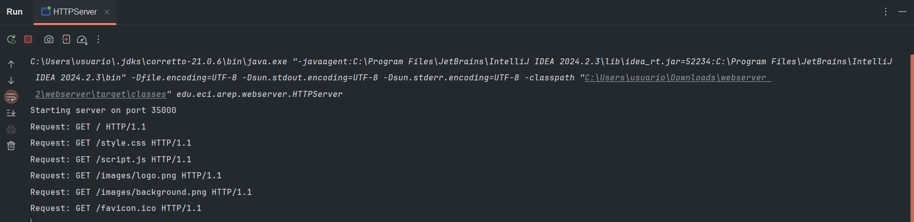
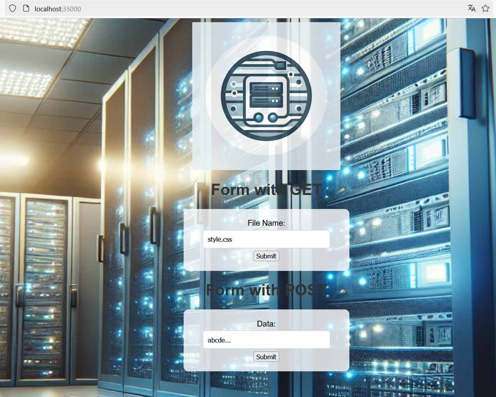

# Servidor Web en Java (Sin Frameworks)

Este proyecto es un servidor web minimalista desarrollado en Java sin el uso de frameworks. Permite manejar múltiples solicitudes secuenciales, servir archivos estáticos y proporcionar una API REST para comunicación con una aplicación web en JavaScript.

## Instalación

### Requisitos
- Java 11 o superior
- Maven
- Un navegador web moderno

### Pasos de Instalación
1. Clona este repositorio:
   ```sh
   git clone https://github.com/AlejoCNYT/AREP-Taller1
   cd <NOMBRE_DEL_DIRECTORIO>
   ```
2. Compila el proyecto con Maven:
   ```sh
   mvn clean package
   ```

## Ejecución

### Servidor Web
Abre la clase HTTPServer.java, ubicada en edu.eci.arep.webserver y ejecuta.

Por defecto, el servidor escuchará en `http://localhost:35000`.

### Acceso a la Aplicación Web
Una vez el servidor esté en ejecución, abre un navegador y accede a:
```
http://localhost:35000/index.html
```

El botón submit de GET, regresará el archivo contenido en la carpeta resources y, el de POST procesará el texto ingresado.




## Arquitectura del Prototipo

### Componentes Principales
1. **Servidor HTTP**: Maneja solicitudes y respuestas HTTP de manera secuencial.
2. **Gestor de Archivos Estáticos**: Permite servir archivos HTML, CSS, JS e imágenes.
3. **Manejador de Solicitudes REST**: Implementado con soporte para métodos `GET` y `POST`.
4. **Aplicación Web Cliente**: Desarrollada en HTML, CSS y JavaScript, interactúa con el backend mediante AJAX.

### Estructura del Código
```
/src/main/java
   ├── server
   │   ├── HttpServer.java (servidor principal)
   ├── app
   |   ├── images
   |   ├   ├── logo.png 
   |   |   ├── background.png
   │   ├── index.html
   │   ├── style.css
   │   ├── app.js
```

## Evaluación y Pruebas

### Pruebas Unitarias
Las pruebas unitarias se realizaron con JUnit y Mockito para validar el correcto funcionamiento de los componentes clave:
```sh
mvn test
```
Las principales pruebas incluyen:
- Validación de respuestas HTTP (200, 404, 500)
- Manejo de archivos estáticos
- Respuestas JSON en la API REST

### Pruebas Manuales
Se realizaron pruebas en diferentes navegadores (Chrome, Firefox) para verificar la correcta carga de la aplicación web y las respuestas del servidor.

#### Daniel Alejandro Acero

